Here's a thorough analysis of your codebase, followed by a visual roadmap.

---

## Where you stand today

Your codebase is a well-structured MVP. The core loop works end-to-end: generate a prompt → call an image model → bake text onto the canvas → produce narrated MP4 → concat a full movie. The AI agent chain (CrewAI planner + consistency + story page agents) is more sophisticated than typical MVPs. The Docker + Vite proxy setup is deployment-ready.

**What's solid:** the dual-mode architecture (Alphabet Book vs Habit Chart), the multi-model fallback chain (Pollinations → Gemini → HuggingFace), the streaming NDJSON for habit plan generation, and the FFmpeg concat pipeline for full-book video.

**What's hollow:** the `ChildProfile` Pydantic schema exists but there's no UI form for it — the child is currently hardcoded as "Rithvin, 3-year-old boy." There's no auth, no saved projects, no payment layer, and no PDF/print export despite that being a primary use case for parents who want physical books.

---

## Priority fixes (before any new features)

**1. Child profile form** — expose the existing schema as a sidebar form. Name, age, gender, skin tone, hair, outfit color. This is the single biggest customisation lever and it's already wired in the backend. One afternoon of work.

**2. State persistence** — currently all generated images are in React state and lost on refresh. Even `localStorage` would be a meaningful improvement. A proper backend with SQLite + S3-compatible storage (MinIO) unlocks saved projects and the ability to resume work.

**3. Stop generation button** — the `AbortController` is wired up but the UI "Stop" button is missing from the sidebar. Small UX fix with outsized impact when generating 26 pages.

---

## Feature additions for ROI and product expansion

**High ROI (relatively easy, high customer value)**

- **PDF / print-ready export** using `reportlab` or `weasyprint` on the backend. A5 layout with the baked image + story text, bleed marks, spine. Parents and teachers want physical books. This unlocks POD (print-on-demand) integration with Lulu or Amazon KDP.
- **Number book (1–10) and shape/color book templates** — same pipeline, just new `LETTERS_DATA`-style JSON files. Each new template is a new SKU.
- **Language selection** — the prompt already has a `language` field. Adding Hindi, Spanish, French, Arabic (RTL) multiplies your addressable market significantly. Edge TTS supports all of these natively.

**Medium effort, strong differentiation**

- **Custom story AI** — let the user type "my son loves dinosaurs" and have Claude generate a fully custom 10-page story with consistent characters. Uses the same CrewAI agent architecture you already have.
- **Flashcard / quiz mode** — from the generated alphabet images, auto-generate a matching game or fill-in-the-blank quiz. Zero new AI calls, just UI.
- **Teacher dashboard** — class-level view, generate books for 20+ children at once using bulk profile upload (CSV). Schools are a high-LTV customer.

**Monetisation layer**

- **Stripe + credit system** — free tier: 3 pages / month with watermark. Pro ($9/mo): unlimited pages, no watermark, PDF export. Studio ($29/mo): white-label, custom child profiles, API access.
- **White-label API** — sell the `/generate-image` + `/generate-audio-video` pipeline to edtech companies. The backend is already structured as a clean REST API.
- **Marketplace of templates** — community-submitted habit charts and book themes. Revenue share for contributors. This scales content without scaling your own effort.

**Biggest long-term moat**

The combination of consistent character rendering + narrated video + print-ready PDF is genuinely rare in this space. Most tools do one of the three. Tightening that loop — especially adding print-on-demand fulfillment — turns this from a content tool into a personalised children's book publisher.