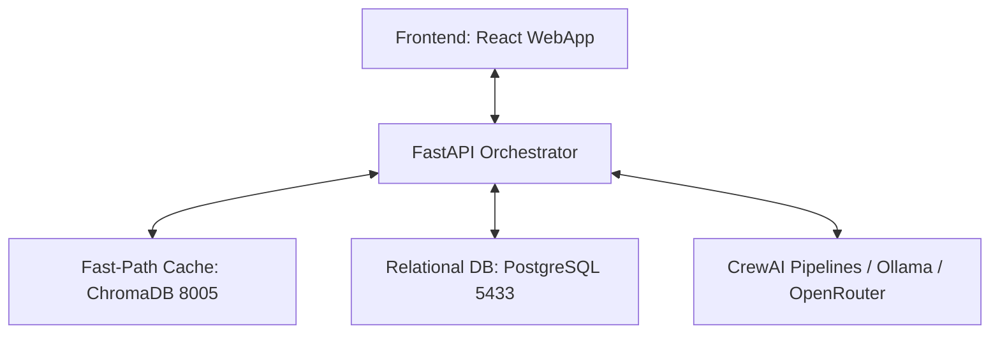

Here is a high-level executive summary of the **Phase 3** features and architecture implemented compared to the base Git version, detailing how they work, how they are integrated, and how they interact with existing features.

---

### **Executive Summary: Phase 3 Capabilities**

Phase 3 transitions the application from a stateless prototype to a **stateful, production-grade enterprise platform**. The core focus is on **performance optimization (caching)**, **visual consistency (AI agents)**, **human-in-the-loop review**, and **user analytics (feedback)**.

---

### **1. Key Features & Functionality Added**

#### **🚀 Fast-Path Semantic Caching (ChromaDB + PostgreSQL)**
* **How it works:** Instead of running the slow and costly CrewAI pipeline for every single request, the API now runs a vector similarity search on ChromaDB using `all-MiniLM-L6-v2` embeddings. 
* **The Benefit:** If a user requests a book with a similar topic, age, and style (e.g., *"Potty training for a 3-year-old in Pixar style"*), the system achieves a **"cache hit"**. It instantly retrieves the pre-generated story template from PostgreSQL, personalizes it with the new child's details, and returns the result in **seconds instead of minutes**, saving API costs.

#### **🎨 Visual Character Consistency (Character Sheet Agent)**
* **How it works:** We introduced a new, specialized **Character Sheet Agent** to the CrewAI pipeline. 
* **The Benefit:** It designs a canonical visual guide (clothing, hair, skin tone, environment) *once* at the start of a project. This sheet is saved to PostgreSQL and injected into the prompt generator for every single page. This eliminates the "shifting character" problem where the child's clothing or appearance would change randomly from page to page.

#### **🛠️ Human-in-the-Loop Review Panel (`AgentReviewPanel`)**
* **How it works:** A premium, sliding overlay panel has been integrated directly into the web application. 
* **The Benefit:** Users can inspect the raw drafts generated by the **Planner Agent** (scenes) and **Character Sheet Agent** (character design) before final rendering. The user can edit the descriptions, modify character attributes, and hit "Save Edits". The downstream generator will respect their exact overrides.

#### **⭐ Page & Book-Level Feedback Loop**
* **How it works:** Users can rate pages (1–5 stars) or submit a rating for the **entire book at once** with optional text feedback.
* **The Benefit:** Feedback is saved in PostgreSQL alongside the project configuration and agent outputs. This creates a data loop that can be analyzed to trace prompt performance and refine agent guidelines.

---

### **2. Are They Live in the WebApp?**
**Yes, they are fully live and running.**
* The Docker container stack has been rebuilt with all backend database dependencies (PostgreSQL 16 on port `5433`, ChromaDB on port `8005`, and SQLAlchemy).
* The Vite dev server proxies all Phase 3 endpoints (e.g., `/search-similar`, `/save-agent-output`, `/get-project`, `/save-feedback`) dynamically, supporting both local host dev and Docker-in-Docker networks.
* The UI elements (Review Panel, Ratings, Character agent selectors) are fully integrated into the main canvas layout.

---

### **3. Integration with Existing Features**

The new features integrate directly into the existing story and video creation workflow without introducing breaking changes:

1. **Before Generation:** The frontend hits `/search-similar`. If a match is found, the UI immediately loads the cached plan; otherwise, it triggers the standard CrewAI orchestrator.
2. **During Generation:** The orchestrator runs, generates the character guide and scene plan, and automatically saves them to PostgreSQL via `/save-agent-output`.
3. **User Action:** The Review Panel slides open, allowing manual edits.
4. **During Image & Media Compilation:** The system reads the *edited* (or raw, if not edited) character guide to generate image prompts, compile narration audio, and merge page videos.
5. **Post-Generation:** The user can rate the page or book, sending the feedback directly to the backend database.