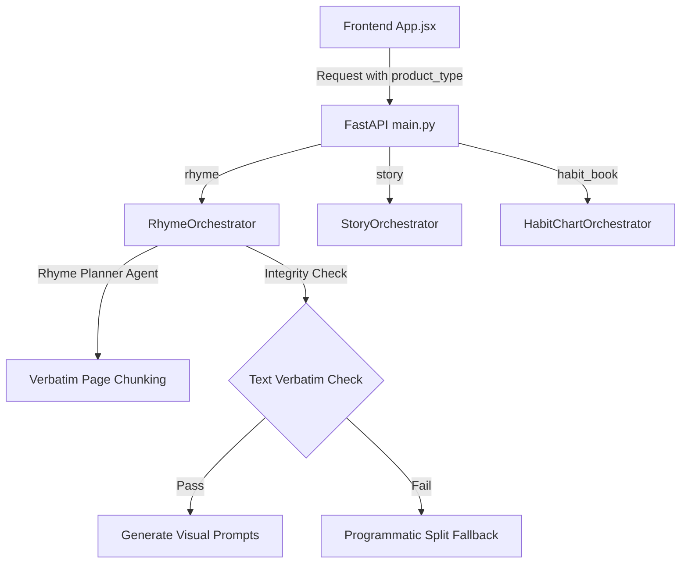

# Phase 4 Implementation Plan: Rhymes & Story Models

This document details the architectural expansion of the Kids Book Generator to support two new product engines: **Nursery Rhymes** and **Creative Stories**. These are structured alongside the existing **Habit Books** framework.

## Goals

1. **Verify Nursery Rhyme Integrity**: Ensure the LLM never invents, deletes, or alters nursery rhyme lines. It must parse the input rhyme and split it across pages verbatim.
2. **Reuse Core Assets**: Keep the unified page layout output consistent (story/rhyme lines, consistent character visual guide, scene action description, composition details).
3. **Structured Image Prompts**: Generate uniform text-to-image prompts using the custom layout (SUBJECT, ACTION, ENVIRONMENT, etc.) across all product modes.
4. **Interactive Controls**: Build frontend components for preset and custom rhymes, and story topic prompts.

---

## Architecture Overview



---

## 1. Nursery Rhymes Product Line

### Verbatim Chunking Strategy
To guarantee that the LLM does not hallucinate new lines, we deploy a two-tiered check:
1. **Verbatim Prompting**: The `Rhyme Planner Agent` is instructed to output JSON chunks mapping stanzas/lines to specific page numbers, with strict orders not to change words.
2. **Programmatic Validation & Fallback**: The backend orchestrator will compare the word set of the planned lines against the original text. If any lines are added, missing, or altered, the backend bypasses the planner agent and splits the stanzas/lines programmatically into equal pages.

### CrewAI Agent Configuration (Rhymes)

* **Rhyme Planner Agent**:
  * **Role**: `Rhyme Planner Agent`
  * **Goal**: Analyze a nursery rhyme and distribute its lines verbatim across pages.
  * **Backstory**: You are a structural book editor. You divide nursery rhymes into sequential page segments. You never alter words, add new lines, or omit text.
  
* **Rhyme Page Task**:
  * **Goal**: Generate scene action descriptions matched to the verbatim rhyme text.
  * **Output Schema**: `action`, `composition`, `details`. The narrative line (`story`) is injected verbatim from the split phase, avoiding any LLM rewriting.

---

## 2. Creative Stories Product Line

### Multi-Scene Plotting
For creative stories, we utilize the existing agents (Planner, Character Sheet, Consistency, Story Page, Illustration) but modify the inputs:
1. **Planner Agent**: Receives a custom story prompt (e.g., *"A baby bear finding a hidden honey pot"*) and plans sequential scenes.
2. **Story Page Agent**: Writes 1–2 toddler-friendly, cheerful narrative sentences per page to form a cohesive storyline.

---

## 3. Unified Prompt Generation

All products (Habit, Rhymes, Stories) assemble their text-to-image prompts using the same format via `text_to_image_prompt`:
```text
SUBJECT: [Character sheet description]
ACTION: [Scene action description]
ENVIRONMENT: [Style environment]
STYLE: [Preset illustration style]
LIGHTING: [Preset lighting]
COMPOSITION: [Camera composition]
DETAILS: [Scene details]
QUALITY: [High resolution indicators]
NEGATIVE_PROMPT: [Avoidance filters]
GUIDELINES: [Safety guidelines]
```
This ensures uniform styling, lighting, and layout constraints.

---

## 4. API & Database Integration

### Request Payload Updates
The `CorePlanRequest` schema is extended to:
* `product_type: str` (e.g. `"habit_book"`, `"rhyme"`, `"story"`)
* `custom_text: Optional[str]` (holds custom rhyme stanzas or story concept prompts)

### Route Mapping
The `/generate-core-plan` and `/generate-story-pages` endpoints will delegate execution to the appropriate orchestrator based on the request's `product_type`.

---

## 5. UI Control Panel Additions

The controls sidebar will update dynamically based on the chosen **Generator Mode**:
* **Rhymes Mode**:
  * A dropdown containing popular presets (e.g., *Twinkle Twinkle Little Star*, *Jack and Jill*, *Itsy Bitsy Spider*) and a *"Custom"* option.
  * A text area for entering custom rhyme text if *"Custom"* is selected.
* **Story Mode**:
  * A text area to input the story topic or concept (e.g. *"A rabbit goes to space"*).
* **Consistent Page Flow**:
  * The planning progress tracker, Agent Review Panel, and page media compilers will automatically adjust to the active product type.

---

## 6. Dynamic Pages & Minimum Page Controls (Tweak)

To optimize pacing and user controls, the following changes were applied:
1. **Dynamic Pages for Rhymes**: Hides the "Total Pages" option in the UI when **Rhymes** mode is selected. The page count is dynamically set to match the exact number of stanzas in the selected rhyme (or custom rhyme stanzas).
2. **Story Mode Minimum Constraint**: Enforces a minimum of `6` pages for **Story** mode to ensure a proper storytelling narrative arc. The UI limits the input control to `min="6"` in story mode and automatically bumps it if switching modes, while the backend `StoryOrchestrator` clamps it via `max(6, total_pages)`.

---

## 7. Similarity Search Scope Isolation

To prevent cross-product vector matches (e.g. matching nursery rhymes against habit book templates due to partial keyword alignment), the similarity cache search is now strictly scoped by collection/type:
1. **Dynamic Payload**: The frontend pre-flight request sends the actual `product_type` (`rhyme`, `story`, or `habit_book`) corresponding to the active mode.
2. **Metadata Filtering**: The backend HttpClient query in `chroma_client.py` utilizes the metadata filter parameter:
   ```python
   where={"product_type": product_type}
   ```
   This restricts semantic similarity check execution exclusively to templates matching the queried book type.

---

## 8. Project Session Scope & Filtering

To ensure that saved projects are correctly organized and easily accessible by mode:
1. **Expose Project Type**: The `/list-projects` endpoint returns the `project_type` field for each project.
2. **Project List Filtering**: The frontend "Open Existing" dropdown filters projects dynamically by comparing their `project_type` against the active `appMode` (supporting common aliases, e.g. matching `alphabet`, `alphabet_book`, or `book` for Alphabet mode).
3. **Session Management for All Modes**: Enabled Project Session Management for all book types, including Alphabet Book.
4. **Universal Loader**: Enhanced the `loadProjectFromDb` method to parse and restore prompts, stories, images, active page selections, and active `appMode` settings for all book types.
