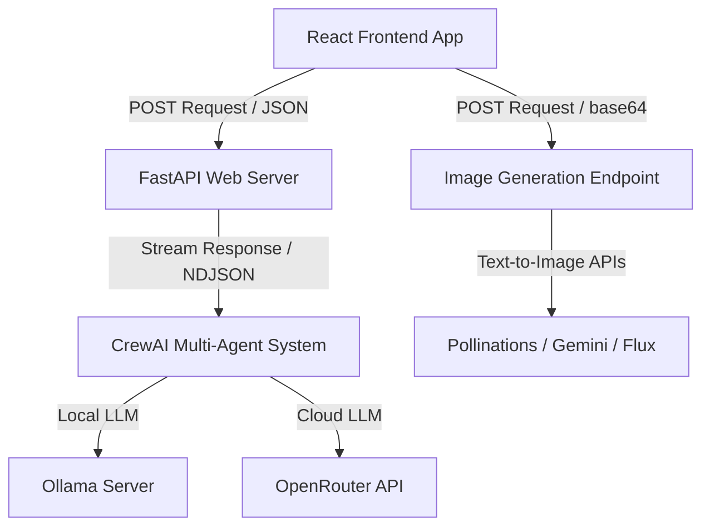
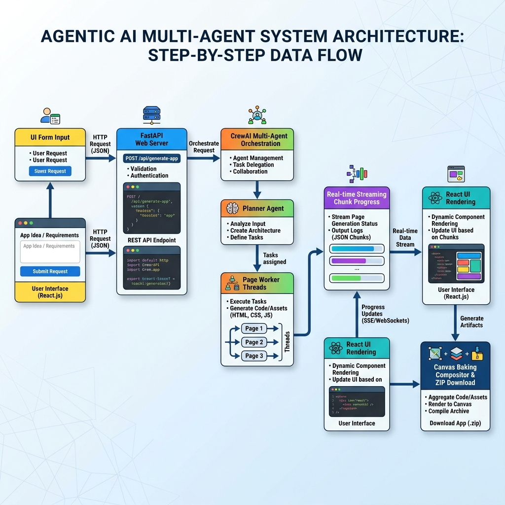

# Kids Book & Habit Chart Generator — Project Overview

Welcome to the **Kids Book & Habit Chart Generator**, a state-of-the-art AI-powered platform designed to dynamically compose beautiful, personalized, and toddler-safe educational materials. By combining modern React design with a powerful FastAPI backend and a multi-agent AI workflow, parents and educators can easily generate interactive A-Z alphabet books and sequential habit-training charts starring their own children.

---

## 🌟 1. What This Project Is About

The primary mission of the **Kids Book & Habit Chart Generator** is to create highly engaging, personalized storybooks and habit visualizers that feature a toddler as the central protagonist. 

To ensure the content is appropriate for toddlers, the entire platform is locked down under strict safety guidelines.

> [!IMPORTANT]
> ### 🛡️ Strict Toddler-Safety Guidelines
> * **100% Wholesome & Safe:** Absolutely no nudity, bare skin, or explicit toilet/bathroom graphics are permitted.
> * **Consistent Toddler Attire:** The protagonist child is styled in a cute, oversized t-shirt and colorful training shorts/underwear in every single frame to maintain physical consistency and safety.
> * **Celebration-Based Visuals:** Explicit potty scenes or graphic bathroom visuals are strictly replaced with magical toddler-friendly symbols, such as colorful sparkles, happy stars, cute emojis, and reward icons.
> * **Premium Pixar Style:** High-definition, printable illustrations rendered in a warm, expressive 3D Pixar cartoon style to capture a child's attention.

---

## 📦 2. Core Modules

The platform is designed around two core modules, each with a highly intuitive and unified interface:

### 🅰️ Module A: Alphabet Book Generator (A-Z)
An interactive storybook generator that leads children through the alphabet using personalized, high-fidelity story scenarios.
* **Pre-Seeded Prompts:** A comprehensive dictionary of 26 curated A-Z cartoon prompts (e.g., "A for Apple", "B for Butterfly") starring the child.
* **Editable Prompts & Stories:** Users can instantly view and customize the image-generation prompt or edit the default story sentence (e.g., *"A is for Apple. Sweet and red, juicy fruit!"*) for any letter.

### 🚽 Module B: Interactive Habit Chart Generator
A sequential visual behavior tracker designed to guide toddlers through important milestones (like potty training, tooth brushing, or bedtime routines).
* **Multi-Stage Training Plan:** The user inputs the habit title, total scenes, and preferred number of pages.
* **Chronological Story Sequences:** An advanced AI planner maps out a seamless, logical flow from start to finish without repeating events.
* **Personalized Visual Cues:** Beautiful step-by-step guides helping children visualize success milestones with positive rewards.

---

## 🛠️ 3. How We Have Implemented It (Architecture)

The platform is engineered using a robust, decoupled full-stack architecture with a highly-efficient React client and an agentic Python backend:



### 💻 3.1 Symmetrical Frontend Framework (React 18 + Vite)
We implemented a **highly symmetric, fully-reused visual system** in the client app (`frontend/src/App.jsx`) to ensure that all core functionalities exist in a common container rather than being duplicated across modules:

1. **Unified State & Navigation Context:** Dynamically switches and maps references (`activePageKey`, `activePromptText`, `activeStories`) to letters or habit pages, preventing complex conditional branches.
2. **Shared Image Generator:** A single high-performance pipeline that reads custom prompts and child photos, making concurrent requests to text-to-image backends.
3. **Universal HTML5 Canvas Compositor:** A custom asynchronous banner renderer (`bakePage`) that overlays slate-800 Georgia serif stories directly onto base64 illustrations with an indigo-200 divider bar:
   ```javascript
   // Bakes stories seamlessly as a bottom 18% banner in high-res outputs
   const bannerHeight = Math.round(img.height * 0.18);
   ctx.fillStyle = '#ffffff';
   ctx.fillRect(0, img.height, canvasW, bannerHeight);
   ctx.fillStyle = '#c7d2fe';
   ctx.fillRect(0, img.height, canvasW, 3); // Indigo separator
   ```
4. **Sequential ZIP Packager:** Uses `JSZip` and `file-saver` to sequentially bake and compress all completed pages into a single ZIP archive (`ABCD_Book_Pages.zip` or `Habit_Pages.zip`).

---

### 🐍 3.2 Agentic Backend & Dynamic LLM Swapping (FastAPI + CrewAI)
The backend (`app/main.py`) acts as a secure, fast API router that serves built production static assets and houses the CrewAI workflows:

* **Dynamic Text Model Swapping:** The system supports both local and cloud text models on the fly through a unified provider selector:
  * **Ollama (Local):** Executes local running models (`qwen3:1.7b` at `http://host.docker.internal:11434`).
  * **OpenRouter (Cloud):** Connects to cloud API providers (`google/gemma-2-9b-it:free`) when remote processing is desired.
* **Strict Narrative Sequencing (`app/agents.py`):** 
  To enforce a logical story progression across parallel execution threads, the `HabitChartCrew` first pre-plans a chronological outline (`full_outline`) and explicitly injects it into downstream page executors.
* **Strict Character Detail Consistency:**
  To guarantee that visual safety details (fully clothed child, red t-shirt, and training shorts) are maintained, the `task_illustration` agent utilizes strict copy instructions to preserve the subject character block word-for-word.
* **Real-time NDJSON Progress Streaming:**
  FastAPI uses a streaming endpoint (`/generate-habit-chart`) to chunk plan details back to the React UI as they arrive, enabling the progress indicator to tick in real time (`Pages ready: 3 / 6`) and allowing the user to select and view finished pages instantly.

---

### 🤖 3.3 Agentic Workflow Sequence (UI Input to Final Output)

Here is a visual map of the entire data and agent execution flow, from the initial user input on the UI to the final baked sequential ZIP/PNG download:



#### 📝 Step-by-Step Data Flow Diagram (Unicode Box Representation):

```text
┌────────────────────────────────────────────────────────────────────────┐
│                      STEP 1: USER INPUT & TRIGGER                      │
│ - User inputs Habit Title, Scene count, Page count, and Text Model     │
│ - User clicks "Generate Chart Plan" button                             │
└───────────────────────────────────┬────────────────────────────────────┘
                                    │ (POST request)
                                    ▼
┌────────────────────────────────────────────────────────────────────────┐
│                        STEP 2: FASTAPI ROUTER                          │
│ - Receives inputs at "/generate-habit-chart" endpoint                  │
│ - Invokes the CrewAI multi-agent workflow                              │
└───────────────────────────────────┬────────────────────────────────────┘
                                    │ (Initializes Crew)
                                    ▼
┌────────────────────────────────────────────────────────────────────────┐
│                 STEP 3: CREWAI AGENTIC WORKFLOW                       │
│                                                                        │
│ ┌────────────────────────────────────────────────────────────────────┐ │
│ │ 1. PLANNER AGENT (task_plan)                                       │ │
│ │    - Analyzes title and pre-plans structured chronological outline   │ │
│ └──────────────────────────────────┬─────────────────────────────────┘ │
│                                    │ (Sorted Outline Array)            │
│                                    ▼                                   │
│ ┌────────────────────────────────────────────────────────────────────┐ │
│ │ 2. PARALLEL WORKER THREADS (Story & Illustration Agents)           │ │
│ │    - Story Agent fits narrative cleanly into outline flow          │ │
│ │    - Illustration Agent applies strict child attire & visual rules │ │
│ └──────────────────────────────────┬─────────────────────────────────┘ │
│                                    │ (Unified Story & Prompt JSON)     │
│                                    ▼                                   │
└───────────────────────────────────┬────────────────────────────────────┘
                                    │ (Streams chunks as they complete)
                                    ▼
┌────────────────────────────────────────────────────────────────────────┐
│                     STEP 4: NDJSON PROGRESS STREAM                     │
│ - FastAPI yields chunks: {"type": "page", "page": "Page X", "data"}    │
└───────────────────────────────────┬────────────────────────────────────┘
                                    │ (NDJSON chunk payload)
                                    ▼
┌────────────────────────────────────────────────────────────────────────┐
│                   STEP 5: CLIENT-SIDE UI RENDERING                     │
│ - Stream decoder parses raw chunk packets in real time                 │
│ - Displays exact progress on button: "Pages ready: X / Y"              │
│ - Numerically sorts completed pages in select dropdown                 │
│ - Automatically pre-populates and loads editable Prompt & Story fields │
└───────────────────────────────────┬────────────────────────────────────┘
                                    │ (User clicks Generate Image)
                                    ▼
┌────────────────────────────────────────────────────────────────────────┐
│                  STEP 6: IMAGE RENDER & BAKE EXPORT                    │
│ - App posts child reference photo + tweaked prompt to /generate-image  │
│ - Renders Pixar style base64 illustration in Canvas container          │
│ - HTML5 Canvas compositor bakes slate-800 story banner onto image      │
│ - Outputs sequential high-res PNG download or packages ZIP archive     │
└────────────────────────────────────────────────────────────────────────┘
```
---

## ⚡ 4. Fast-Start Execution

## ⚡ 4. Fast-Start Execution

### Development Mode (Concurrent)
1. **Backend Server:**
   ```bash
   pip install -r requirements.txt
   uvicorn app.main:app --host 0.0.0.0 --port 8003 --reload
   ```
2. **Frontend Dev Server:**
   ```bash
   cd frontend
   npm install
   npm run dev
   ```

### Production Static Build
To run everything directly from the FastAPI endpoint (`http://localhost:8003/`), build the production-ready React client:
```bash
cd frontend
npm run build
```
The FastAPI web server automatically serves the built index and bundles from `frontend/dist/` directly under `/` and `/assets`.

---

> [!TIP]
> **Pro-Tip for Creators:** When creating personalized books, upload a clear, front-facing portrait photo of the child. The image-to-image reference engine will blend their facial features with the Pixar character model for an incredibly magical result!
